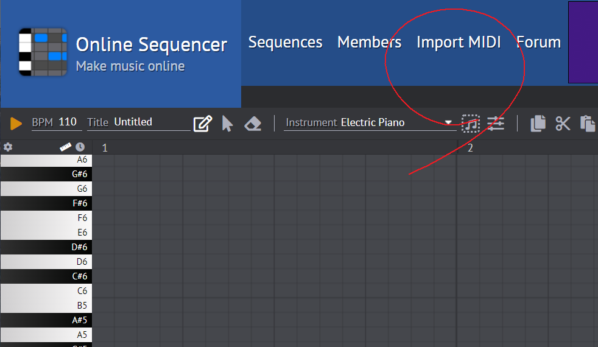

# magenta_tutorial
<table align="left">
  <td>
    
  </td>
</table>

 
 
 

# cmd로 midi 파일 전처리 및 checkpoint 만드는 방법 정리
### 만약 custom checkpoint 및 tfrecord를 다 만들었다면,   magenta_musicvae_4bar_code.py 를 수정해서 바로 실행하면 output 제작 가능합니다

### output 폴더에서 custom dataset으로 만든 midi 파일을 확인할 수 있습니다
before :

 

open cmd  
create python 3.6.x version virtual environment  
pip install magenta  

 

## [sample command]

music_vae_generate \ --config=cat-drums_2bar_small.hikl \ --checkpoint_file=C:/magenta_tutorial/checkpoints/cat-drums_2bar_small.hikl.tar \ --mode=sample \ --num_outputs=5 \ --output_dir=C:/magenta_tutorial/output

music_vae_generate \ --config=cat-drums_2bar_small.lokl \ --checkpoint_file=C:/magenta_tutorial/checkpoints/cat-drums_2bar_small.lokl.tar \ --mode=sample \ --num_outputs=5 \ --output_dir=C:/magenta_tutorial/output

music_vae_generate \ --config=cat-mel_2bar_big \ --checkpoint_file=C:/magenta_tutorial/checkpoints/cat-mel_2bar_big.tar \ --mode=sample \ --num_outputs=5 \ --output_dir=C:/magenta_tutorial/output

music_vae_generate \ --config=groovae_2bar_add_closed_hh \ --checkpoint_file=C:/magenta_tutorial/checkpoints/groovae_2bar_add_closed_hh.tar \ --mode=sample \ --num_outputs=5 \ --output_dir=C:/magenta_tutorial/output

music_vae_generate \ --config=groovae_2bar_hits_control \ --checkpoint_file=C:/magenta_tutorial/checkpoints/groovae_2bar_hits_control.tar \ --mode=sample \ --num_outputs=5 \ --output_dir=C:/magenta_tutorial/output

music_vae_generate \ --config=groovae_2bar_humanize \ --checkpoint_file=C:/magenta_tutorial/checkpoints/groovae_2bar_humanize.tar \ --mode=sample \ --num_outputs=5 \ --output_dir=C:/magenta_tutorial/output

music_vae_generate \ --config=groovae_2bar_tap_fixed_velocity \ --checkpoint_file=C:/magenta_tutorial/checkpoints/groovae_2bar_tap_fixed_velocity.tar \ --mode=sample \ --num_outputs=5 \ --output_dir=C:/magenta_tutorial/output

music_vae_generate \ --config=groovae_4bar \ --checkpoint_file=C:/magenta_tutorial/checkpoints/groovae_4bar.tar \ --mode=sample \ --num_outputs=5 \ --output_dir=C:/magenta_tutorial/output

music_vae_generate \ --config=hierdec-mel_16bar \ --checkpoint_file=C:/magenta_tutorial/checkpoints/hierdec-mel_16bar.tar \ --mode=sample \ --num_outputs=5 \ --output_dir=C:/magenta_tutorial/output

music_vae_generate \ --config=hierdec-trio_16bar \ --checkpoint_file=C:/magenta_tutorial/checkpoints/hierdec-trio_16bar.tar \ --mode=sample \ --num_outputs=5 \ --output_dir=C:/magenta_tutorial/output

music_vae_generate \ --config=nade-drums_2bar_full \ --checkpoint_file=C:/magenta_tutorial/checkpoints/nade-drums_2bar_full.tar \ --mode=sample \ --num_outputs=5 \ --output_dir=C:/magenta_tutorial/output

run_dir  
checkpoint_file  
output_dir = 'tmp/music_vae/generated'  
config  
mode = sample  
input_midi_1  
input_midi_2  
num_outputs = 5  
max_batch_size = 8  
temperature = 0.5  
log = INFO  

 
 

## [ interpolation command]

music_vae_generate --config=cat-mel_2bar_big --checkpoint_file=C:/magenta_tutorial/checkpoints/groovae_4bar.tar --mode=interpolate --num_outputs=5 --input_midi_1=C:/Users/USER/magenta/input/interpolation1.mid --input_midi_2=C:/Users/USER/magenta/input/interpolation2.mid --output_dir=C:/Users/USER/magenta/output

 
 
 

## [ custom data sequence ]

convert_dir_to_note_sequences --input_dir=C:/magenta_tutorial/input/groove_onlymidi/drummer1/session1 --output_file=C:/magenta_tutorial/custom_tfrecord/onlymidi_record.tfrecord --recursive

 
 
 

 

## [ train ]

music_vae_train --config=groovae_4bar --run_dir=C:/magenta_tutorial/run_dir --mode=train --examples_path=C:/magenta_tutorial/custom_tfrecord/onlymidi_record.tfrecord

master = ''  
examples_path  
tfds_name  
run_dir  
num_steps  
eval_num_batches  
checkpoints_to_keep = 100  
keep_checkpoint_every_n_hours = 1  
mode = 'train'  
config = ''  
hparams = ''  
cache_dataset = True  
task = 0  
num_ps_tasks = 0  
num_sync_workers = 0  
eval_dir_suffix = ''  
log = INFO  

run_dir 경로 안에 train 폴더를 만든 다음 checkpoint를 저장하므로,  
run_dir을 적절하게 설정해줄 것

!  
checkpoint 파일은 아래 세 개가 한 쌍입니다  
model.ckpt-14.data-00000-of-00001  
model.ckpt-14.index  
model.ckpt-14.meta  
!

#
magenta에서 제공하는 checkpoint를 살펴보면, 대부분이 epoch이 3000에 가깝습니다  
허나 저는 epoch을 170에서 멈췄고 그 결과 굉장히 심심한 드럼 트랙이 출력되었습니다  
A Hierarchical Latent Structure for Variational Conversation Modeling 논문에 의하면 오버피팅을 걱정할 필요가 줄었을텐데,  
왜 epock를 다른 checkpoint와 다르게 170만 했는가라 물으신다면,  
제 개인 컴퓨터 ryzen 5950x cpu로 학습하는데 cpu를 거의 100% 사용해서 컴퓨터 수명을 위해 epoch을 낮췄습니다  
이해해주시면 감사하겠습니다  
#

[ custom generate ]

music_vae_generate --config=groovae_4bar --checkpoint_file=C:/magenta_tutorial/checkpoints/custom.tar \ --mode=sample \ --num_outputs=5 \ --output_dir=C:/magenta_tutorial/output

after:

open the online sequenser shortcut
click import midi
select predict midi file
click continue button

You can check the midi file by pressing the play button

## paper review reference :

https://youtu.be/lywSmdxlsGs  
https://youtu.be/alq-RgjGKPA  

## python music reference :

https://youtu.be/R37TW97drWA  
https://youtu.be/qjFFPDLDLEo  

## python audio reference :

https://www.youtube.com/playlist?list=PL7ZVZgsnLwEGskuPmm2-pYsNKY8Ihs5AP  

## A Hierarchical Latent Structure for Variational Conversation Modeling 보조 한글번역
https://arxiv.org/pdf/1803.05428.pdf  

추상적인
VAE(Variational Autoencoder)는
의미론적으로 생성하기 위한 효과적인 모델이 될 것
자연 데이터에 대한 의미 있는 잠재 표현
그러나 지금까지 적용 범위가 제한적이었습니다.
순차 데이터, 그리고 우리가 보여주듯이 기존
반복되는 VAE 모델은 모델링에 어려움이 있습니다.
장기 구조의 시퀀스. 주소
이 문제에서 우리는 계층 구조의 사용을 제안합니다.
디코더는 먼저 입력의 하위 시퀀스에 대한 임베딩을 출력한 다음 이러한 임베딩을 사용하여 각 하위 시퀀스를 독립적으로 생성합니다. 이 구조는 모델이
잠재적인 코드를 활용하여 문제로 남아 있는 "후방 붕괴" 문제를 방지합니다.
재발하는 VAE의 경우. 우리는 이 아키텍처를 적용합니다
음표의 시퀀스를 모델링하고
보다 극적으로 더 나은 샘플링, 보간 및 재구성 성능을 나타냅니다.
"평평한" 베이스라인 모델. 우리의 구현
"MusicVAE"는 온라인에서 사용할 수 있습니다.2
1. 소개
생성 모델링은 추정의 프레임워크를 설명합니다.
생성하는 데 사용되는 기본 확률 분포 p(x)
데이터 엑스. 이를 통해
감독되지 않은 표현에 대한 새로운 데이터 포인트 샘플링
학습된 분포에서 기존 데이터 포인트의 확률을 추정하는 방법을 학습합니다. 최근 진행 상황
생성 모델링에서
심층 신경망, "심층 생성 모델" 생성,
딥 네트워크의 표현력을 활용하여
복잡하고 고차원 분포를 모델링합니다. 실제적인 성과에는 다음과 같은 사실적인 이미지 생성이 포함됩니다.
1Google Brain, Mountain View, CA, USA. 다음에 대한 대응:
아담 로버츠 <adarob@google.com>.
제35회 기계에 관한 국제학술회의(International Conference on Machine) 절차
학습, 스웨덴 스톡홀름, PMLR 80, 2018. Copyright 2018
저자에 의해.
2https://goo.gl/magenta/musicvae-code
3https://goo.gl/magenta/musicvae-examples

그림 1. 다음을 사용한 잠재 공간 평균화 시연
뮤직VAE. 상단 및 하단 시퀀스에 대한 잠재 코드
중간 시퀀스를 생성하기 위해 우리 모델에 의해 평균화되고 디코딩됩니다. 잠재 공간 평균은 유사한 반복 패턴을 포함합니다.
상위 시퀀스로, 그러나 더 높은 레지스터에서 간헐적으로
하단 시퀀스처럼 일시 중지됩니다. 이 예의 오디오는 온라인 보충 자료에서 사용할 수 있습니다.3
무화과를 참조하십시오. 부록 E의 12 및 13
기준 비교를 위해.
수백만 픽셀(Karras et al., 2017), 합성 생성
수십만 개의 타임스텝이 있는 오디오(van den
Oord et al., 2016a), 준 지도 학습 작업에서 최첨단 성능을 달성했습니다(Wei et al., 2018).
딥 생성에는 다양한 방법이 사용되었습니다.
생성(Generative)과 같은 암시적 모델을 포함한 모델링
적대적 네트워크(GAN)(Goodfellow et al., 2014)
PixelCNN과 같은 명시적 심층 자기회귀 모델
(van den Oord et al., 2016b) 및 WaveNet(van den Oord
et al., 2016a). 이 작업에서는 깊은 잠재 변수에 중점을 둡니다.
VAE(Variational Autoencoder)(Kingma
& 웰링, 2014; Rezende et al., 2014). 장점
이 모델은 p(z|x)와
p(z), 여기서 z는 추론할 수 있는 잠재 벡터입니다.
기존 데이터에서 또는 잠재 공간에 대한 분포에서 샘플링됩니다. 이상적으로, 잠재 벡터는 적절한
주어진 데이터 포인트의 특성 및 요소 풀기
데이터 세트의 변형. 이러한 자동 인코더는 또한
효율적인 방법을 제공하는 가능성 p(x|z)
잠재 벡터를 데이터 공간에 다시 매핑합니다.
깊은 잠재 변수 모델에 대한 우리의 관심은 주로
기계를 창의적으로 응용하는 데 점점 더 많이 사용되기 때문에
학습(Carter & Nielsen, 2017; Ha & Eck, 2018; Engel
et al., 2017a). 이것은 놀랍고 편리한
이들에 의해 일반적으로 학습된 잠재 공간의 특성
모델. 예를 들어, 모든 잠재 코드의 평균
주어진 속성을 소유한 데이터 포인트는 이른바
대상 변경에 사용할 수 있는 속성 벡터
데이터 예제에. 일부 속성으로 데이터 포인트 인코딩
(가령, 갈색 머리를 가진 사람의 사진)
잠재 코드, 해당 속성 벡터 빼기
("갈색 머리" 벡터), 다른 속성 벡터 추가
("금발머리") 및 결과 잠재 벡터를 디코딩하면
초기 지점의 현실적인 표현을 생성합니다.
속성 교환 (동일한 금발 머리)
(Larsen et al., 2016; Mikolov et al., 2013). 다른 것으로
예, 잠재 벡터 간 보간 및 디코딩
궤적의 점은 현실적인 중간을 생성할 수 있습니다.
특성 사이를 변형하는 데이터 포인트
부드럽고 의미 론적으로 의미있는 방식으로 끝납니다.
심층 잠재 변수 모델에 대한 대부분의 작업은
고정 차원의 연속 값 데이터, 예:
이미지. 순차적 데이터 모델링은 덜 일반적이며, 특히 악보와 같은 개별 토큰 시퀀스,
일반적으로 자동 회귀 디코더를 사용해야 합니다.
이는 부분적으로 자기회귀가 종종 충분하기 때문입니다.
오토인코더가 잠재 코드를 무시한다는 점에서 강력합니다(Bowman et al., 2016). 그들은 약간의 성공을 보여주면서도
짧은 시퀀스(예: 문장), 깊은 잠재 변수
모델은 아직 매우 오랫동안 성공적으로 적용되지 않았습니다.
시퀀스.
이 격차를 해결하기 위해 계층적 순환 디코더가 있는 새로운 순차 자동 인코더를 소개합니다.
위에서 언급한 모델링 문제를 장기적으로 극복
반복되는 VAE가 있는 구조. 우리 모델은 전체
많은 것을 가능하게 하는 단일 잠재 벡터로의 시퀀스
이미지의 VAE가 즐기는 창의적인 응용 프로그램입니다. 우리
우리 모델이 효과적으로 수행할 수 있음을 실험적으로 보여줍니다.
기준선보다 상당히 긴 시퀀스를 자동 인코딩
"flat" 디코더 RNN이 있는 모델.
이 논문에서는 음표 시퀀스 모델링의 적용에 중점을 둡니다. 서양 대중 음악 전시
악곡의 소절과 섹션 사이의 반복과 변화와 같은 강력한 장기 구조.
이 구조는 또한 계층적입니다. 노래는 다음과 같이 나뉩니다.
측정 단위로 분할된 다음 섹션으로 나뉩니다.
비트 등이 있습니다. 또한 음악은 기본적으로 다중 스트림 신호입니다.
플레이어 간 의존성이 강한 플레이어. 이러한 독특한
속성, 잠재적인 크리에이티브 애플리케이션 외에도
음악을 순차 자동 인코더를 위한 이상적인 테스트베드로 만드십시오.
작업 배경을 다룬 후 우리의 접근 방식이 구축됩니다.
에, 우리는 우리의 모델과 그것의 새로운 아키텍처 향상에 대해 설명합니다. 그런 다음 관련 작업에 대한 개요를 제공합니다.
시퀀스에 잠재 변수 모델을 적용할 때. 드디어,
우리는 음악을 모델링하는 방법의 능력을 보여줍니다.
정량적, 정성적 평가를 통해 데이터를 제공합니다.

2. 배경
기본적으로 우리 모델은 autoencoder입니다. 즉, 목표는
입력을 정확하게 재구성합니다. 그러나 우리는 새로운 샘플을 추출하고 수행하는 기능을 추가로 원합니다.
잠재 공간 보간 및 속성 벡터 산술.
이러한 속성에 대해 Variational Autoencoder의 프레임워크를 채택합니다. 시퀀스에 VAE를 성공적으로 사용
VAE 목표에 대한 몇 가지 추가 확장의 이점. 다음 하위 섹션에서는 이전 작업을 다룹니다.
이는 우리 접근 방식의 중추를 형성합니다.

2.1. 변형 자동 인코더
자동 인코더에 적용되는 일반적인 제약 조건은
입력에 대한 관련 정보를 압축
저차원 잠재 코드. 이상적으로는 모델을 강제로
데이터 세트의 중요한 변동 요인을 캡처하는 압축된 표현을 생성합니다. 추구
이 목표는 Variational Autoencoder(Kingma & Welling,
2014년; Rezende et al., 2014)
잠재 코드 z는 사전 p(z)에 따라 분포된 랜덤 변수입니다. 데이터 생성 모델은 다음과 같습니다.
z ~ p(z), x ~ p(x|z). VAE는 인코더로 구성됩니다.
qλ(z|x), 이는 사후 p(z|x)에 가깝고, a
디코더 pθ(x|z), 우도 p(x|z)를 매개변수화합니다.
실제로, 대략적인 사후 및 우도 분포("인코더" 및 "디코더")는 다음과 같이 매개변수화됩니다.
매개변수가 각각 λ 및 θ인 신경망. Variational Inference의 틀에 따라 우리는 우리 사이의 KL 발산을 최소화하여 사후 추론을 수행합니다.
근사 사후, 인코더 및 실제 사후
증거 하한(ELBO)을 최대화하여 p(z|x)
E[log pθ(x|z)] − KL(qλ(z|x)||p(z)) ≤ log p(x) (1)
여기서 기대치는 z ∼ qλ(z|x)에 대해 취해집니다.
KL(·||·)은 KL 발산입니다. 순진하게 계산하기
ELBO를 통한 기울기는 샘플링으로 인해 실행 불가능
z를 구하는 데 사용되는 작업입니다. 일반적인 경우 p(z)
대각 공분산 가우시안이므로 우회할 수 있습니다.
z ~ N(μ, σI)을 다음으로 대체하여
∼ N(0, I), z = µ + σ

2.1.1. β-VAE 및 무료 비트
VAE에서 사용된 ELBO를 해석하는 한 가지 방법
E[log pθ(x|z)] 및
KL(qλ(z|x)||p(z)), 별도로. 먼저 생각할 수 있는
의 z 샘플에 대해 p(x|z)가 높음을 요구하므로
qλ(z|x) - 정확한 재구성을 보장합니다. 두 번째는 qλ(z|x)가 사전에 가까워지도록 권장합니다.
p(z)에서 잠재 코드를 샘플링하여 현실적인 데이터를 생성합니다.
이러한 용어의 존재는
샘플 및 재구성의 품질 – 또는 동등하게 비율(qλ(z|x)로 인코딩된 정보의 양) 사이
및 왜곡(데이터 가능성)(Alemi et al., 2017).
그대로 ELBO는 이것을 직접 제어할 수 있는 방법이 없습니다.
거래. ELBO에 대한 일반적인 수정은 다음을 소개합니다.
KL 가중치 하이퍼파라미터 β(Bowman et al., 2016;
Higgins et al., 2017) 생산
E[log pθ(x|z)] − β KL(qλ(z|x)||p(z)) (3)
β < 1로 설정하면 모델이 간결한 표현을 학습하는 것보다 재구성 품질을 우선시하도록 권장합니다.
이 절충점을 조정하는 또 다른 접근 방식은 임계값을 초과한 경우에만 KL 정규화 기간을 적용하는 것입니다.
(Kingma et al., 2016):
E[log pθ(x|z)] − max(KL(qλ(z|x)||p(z)) − τ, 0) (4)
이것은 KL(qλ(z|x)||p(z))
qλ(z|x)를 사용하여 p(z)의 샘플을 코딩하는 데 필요한 정보의 양을 측정합니다. 따라서 이 임계값을 활용하면 모델에 "무료
비트"는 대략적인 사후 학습을 할 때 사용합니다. 메모
이러한 수정된 목표는 더 이상 더 낮은
가능성에 제한이 있지만 관습에 따라 우리는 여전히
결과 모델은 "Variational Autoencoder"로 표시됩니다.

2.1.2. 잠재 공간 조작
오토인코더의 광범위한 목표는 데이터의 간결한 표현을 학습하는 것입니다. 창의적인 응용 프로그램을 위해 우리는
모델이 학습한 잠재 공간의 추가 용도
(Carter & Nielsen, 2017; Roberts et al., 2018). 첫째, 주어진
실제 데이터 포인트에 매핑되는 잠재 공간의 한 지점,
근처의 잠재 공간 포인트는 다음과 같은 데이터 포인트에 매핑되어야 합니다.
의미상 비슷하다. 외삽법으로 이것은 모든
두 점을 연결하는 연속 곡선을 따라 점
잠재 공간은 일련의 데이터 포인트로 디코딩할 수 있어야 합니다.
데이터 공간에서 매끄러운 의미론적 보간을 생성합니다.
또한, 이 요구 사항은 잠재적으로
공간은 "매끄럽고" "구멍"이 없습니다.
실제 데이터 포인트에 매핑되지 않는 격리된 영역. 둘째, 우리는 잠재된 공간이 의미 있는 얽힘을 풀기를 바란다.
데이터 세트의 의미 그룹.
이상적으로는 이러한 요구 사항이 VAE에 의해 충족되어야 합니다.
보류 테스트 데이터에서 우도 및 KL 발산 항이 모두 충분히 작은 경우. 보다 실용적인 테스트
이러한 속성은 잠재된 점 사이를 보간하는 것입니다.
공간을 확보하고 데이터의 해당 지점이
공간은 의미적으로 의미 있는 방식으로 보간됩니다.
구체적으로, z1과 z2가 데이터 포인트 x1과 x2에 해당하는 잠재 벡터라면 선형을 수행할 수 있습니다.
계산에 의한 잠재 공간의 보간
cα = αz1 + (1 − α)z2 (5)
α ∈ [0, 1]에 대해. pθ(x|cα)가 현실적이면 목표가 충족됩니다.
의미적으로 모든 α, pθ(x|cα) 전환에 대한 데이터 포인트
α를 변화시키면서 pθ(x|c0)에서 pθ(x|c1)까지 의미 있는 방법
0에서 1로, pθ(x|cα)는 지각적으로 다음과 유사합니다.
작은 δ에 대한 pθ(x|cα+δ). 왜냐하면 이전보다
VAE의 잠재 공간은 구형 가우시안이며 샘플은
고차원 사전

4. 관련 업무
밀접하게 관련된 모델은 앞서 언급한 반복
VAE(Bowman et al., 2016). 우리처럼 그들의 모델은
인코더와 인코더 모두에 대해 RNN을 사용하는 VAE
디코더. 신중한 최적화(Bowman et al., 2016)
사이를 생성하고 보간하는 능력을 보여줍니다.
캐릭터 레벨에서 모델링된 문장.
매우 유사한 모델도 (Fabius & van
Amersfoort, 2015), 제한된 성공으로 적용됨
음악에. 이 접근 방식은 또한 확장된 컨볼루션이 있는 컨볼루션 인코더 및 디코더를 활용하도록 확장되었습니다.
(Yang et al., 2017). 의 주요 차이점
이 모델과 우리는 디코더 아키텍처입니다. 즉,
우리는 계층적 RNN을 사용합니다. 우리가 사용하는 평면 RNN 디코더
섹션 5의 기준선은 크게 저하됨을 나타냅니다.
매우 긴 시퀀스를 처리할 때의 성능.
자동회귀 디코더가 있는 다양한 추가 VAE 모델도 제안되었습니다. (Semeniuta et al., 2017)
RNN이 반복되는 VAE의 확장을 고려하십시오.
피드포워드 및 컨볼루션 네트워크로 대체됩니다.
PixelVAE(Gulrajani et al., 2017)는 VAE를 다음과 결합합니다.
PixelCNN(van den Oord et al., 2016b)을 적용하고
자연스러운 이미지 모델링 작업의 결과입니다. 유사하게,
Variational Lossy Autoencoder(Chen et al., 2017)
PixelCNN/PixelRNN 디코더가 있는 VAE. 저자
또한 디코더의 전력을 제한하고
보다 표현적인 역 자기회귀 흐름(Kingma
et al., 2016)에 앞서 잠재 코드. 의 또 다른 예
순환 인코더 및 디코더가 있는 VAE는 SketchRNN입니다.
(Ha & Eck, 2018),
연속값 펜 좌표.
(Li
et al., 2015)는 우리 작업과 몇 가지 유사점을 가지고 있습니다. 그들 또한
계층적 RNN이 있는 오토인코더를 고려하십시오.
인코더 및 디코더, 계층 구조의 각 레벨
텍스트의 자연스러운 하위 시퀀스에 해당합니다(예: 문장
및 단어). 그러나 그들은 어떤 제약도 부과하지 않습니다
잠재적인 코드에 대한 결과로 샘플링할 수 없습니다.
또는 시퀀스 사이를 보간합니다. 그렇지 않으면 우리의 모델
플랫 양방향 인코더의 사용과
계층의 첫 번째 수준에서 자동 회귀 연결.
보다 광범위하게, 우리의 모델은 sequence-to-sequence 프레임워크(Sutskever et al., 2014)에서 고려될 수 있습니다.
인코더는 디코더를 조정하는 데 사용되는 입력 시퀀스의 압축된 표현을 생성합니다.
출력 시퀀스를 생성합니다. 예를 들어, NSynth
모델은 오디오 파형을 압축하여 임베딩을 학습합니다.
다운샘플링 컨볼루션 인코더를 사용한 다음 WaveNet 스타일 디코더(Engel
et al., 2017b). 순환 시퀀스 대 시퀀스 모델은 다음과 같습니다.
시퀀스 변환 작업에 가장 자주 적용됩니다.
입력 및 출력 시퀀스가 ​​다릅니다. 그럼에도 불구하고,
sequence-to-sequence autoencoder는 예를 들어 보조 unsupervised training으로 때때로 고려되었습니다.
준지도 학습 방법(Dai & Le, 2015) 또는
위에서 설명한 단락 자동 인코더에서. 다시, 우리의
접근 방식은 압축된 표현(잠재 벡터)에 구조를 부과한다는 점에서 다릅니다.
샘플링 및 보간을 수행합니다.
마지막으로 많은 반복 모델이 제안되었습니다.
반복 상태 자체가 확률적 잠재성인 경우
시간에 따른 종속성을 갖는 변수(Chung et al., 2015;
바이엘 & 오센도르퍼, 2014; Fraccaro et al., 2016). 우리 모델과 특히 유사한 예는 (Serban
et al., 2017), 계층적 인코더와
디코더. 그들의 모델은 두 가지 수준의 계층 구조를 사용하고 각 하위 시퀀스에 대한 확률적 잠재 변수를 생성합니다.
입력 시퀀스. 이 클래스의 결정적인 차이점
모델과 우리의 경우 단일 잠재 변수를 사용하여
보간 및 속성 조작과 같은 창의적인 응용 프로그램을 허용하는 전체 시퀀스를 나타냅니다.

5. 실험
MusicVAE의 힘을 보여주기 위해 우리는
음악에 대한 일련의 양적 및 질적 연구
데이터. 먼저 단순 반복 VAE가
(Bowman et al., 2016)에서 설명한 것과 같이 짧은 시퀀스를 효과적으로 생성하고 보간할 수 있습니다.
뮤지컬 악보. 그런 다음 훨씬 더 긴 음표로 이동합니다.
데이터를 효과적으로 모델링하기 위해 새로운 계층적 디코더가 필요한 시퀀스입니다. 이를 확인하려면
주장, 우리는 그것이 할 수 있다는 양적 증거를 제공합니다
속성을 재구성, 보간 및 모델링
기준선보다 훨씬 더 나은 데이터. 우리는 결론
우리의
제안된 모델은 또한
샘플의 인지된 품질.

5.1. 데이터 및 교육
데이터 소스에는 널리 사용되는 디지털 악보 형식인 MIDI 파일을 사용합니다. MIDI 파일에는 지침이 포함되어 있습니다.
각 개별 악기에서 음표를 연주하기 위해
노래뿐만 아니라 미터(타이밍) 정보. 우리는 수집
≈ 웹에서 가져온 150만 개의 고유 파일은 모델 교육에 필요한 충분한 데이터를 제공했습니다. 우리는 다음을 추출했습니다
이러한 MIDI 파일의 교육 데이터 유형: 2-바 및 16-바
멜로디(모노포닉 음표 시퀀스), 2마디 및 16마디 드럼
패턴(다른 드럼 연주에 해당하는 이벤트),
별도의 스트림으로 구성된 16마디 "트리오" 시퀀스
멜로디 라인, 베이스 라인, 드럼 패턴으로 구성되어 있습니다. 더 나아가
데이터세트 생성 프로세스에 대한 자세한 내용은 부록 A를 참조하세요.
비교의 편의를 위해 재구성도 평가했습니다.
공개적으로 사용 가능한 품질(아래 섹션 5.3 참조)
부록 B의 Lakh MIDI 데이터 세트(Raffel, 2016)
우리는 모노포닉 멜로디와 베이스라인을 다음과 같이 모델링했습니다.
16분음표 이벤트의 연속. 그 결과 130-
128개의 MIDI 피치에 대한 128개의 "노트온" 토큰이 있는 차원 출력 공간(토큰에 대한 범주형 배포),
플러스 "메모" 및 "휴식"에 대한 단일 토큰. 드럼 패턴의 경우 General에서 정의한 61개의 드럼 클래스를 매핑했습니다.
MIDI 표준(International MIDI Association, 1991) ~ 9
표준 클래스 및 가능한 모든 조합을 나타냄
512개의 범주형 토큰을 사용한 적중률. 모든 경우에 타이밍을 위해
우리는 음표를 16음 간격으로 양자화했습니다.
바는 16개의 이벤트로 구성되었습니다. 결과적으로 두 개의 막대 데이터
(플랫 디코더와 함께 개념 증명으로 사용됨) 결과
T = 32이고 16-bar 데이터가 있는 시퀀스는 T = 256입니다.
계층적 모델에서 U = 16을 사용합니다.
하위 시퀀스는 단일 막대에 해당합니다.
모든 모델은 Adam을 사용하여 훈련되었습니다(Kingma & Ba, 2014).
10−3에서 어닐링된 학습률
지수 감쇠율이 0.9999이고 배치 크기가 512인 경우 10−5까지입니다.
2- 및 16-바 모델은 50k 및 100k 기울기에 대해 실행되었습니다.
각각 업데이트합니다. 에 대해 교차 엔트로피 손실을 사용했습니다.
예정된 샘플링을 통한 실측 출력(Bengio
et al., 2015) 2-바 모델의 경우 및 16-바의 교사 강제
모델.
5.2. 짧은 시퀀스
반복되는 음악 시퀀스를 모델링한다는 증거로
VAE가 가능합니다. 먼저 2-bar(T = 32) 모델링을 시도했습니다.
모노포닉 음악 시퀀스(멜로디 및 드럼 패턴)
플랫 디코더로. 모델에 허용 오차가 주어졌습니다.
48개의 자유 비트(≈33.3 nat) 및 KL 비용 가중치 β,
지수 비율 0.99999로 0.0에서 0.2로 어닐링되었습니다.
역 시그모이드로 예정된 샘플링이 도입되었습니다.
2000의 비율.
우리는 모델이 입력을 재구성할 때 매우 정확하다는 것을 발견했습니다(아래 섹션 5.3에서 논의된 표 1). 그것
또한 강력한 보간을 생성할 수 있었습니다(그림 14,
부록 E) 및 샘플. 다시 말해서, 사후 코드를 겪지 않고 자신의 잠재 코드를 효과적으로 사용하는 방법을 배웠습니다.
붕괴 또는 노출 편향, 특히
교사 강제와 표본의 상대적으로 작은 차이
재구성 정확도(몇 퍼센트).
이러한 성공에도 불구하고 모델은 16바(T = 256) 시퀀스를 안정적으로 재구성할 수 없었습니다. 예를 들어,
교사 강제 및 샘플링된 재구성 정확도 간의 불일치가 27% 이상 증가했습니다. 이것은 동기
섹션 3.2에 설명된 계층적 디코더의 설계. 다음 섹션에서는 광범위한
제안된 모델을 평평한 기준선과 비교합니다.

5.3. 재건 품질
표 1. 교사 강제(예: 다음 단계 예측) 및 전체 샘플링으로 계산된 재구성 정확도. 모든 값
보류 테스트 세트에 보고됩니다. 1.0의 소프트맥스 온도
모든 경우에 사용되었습니다. 즉, 로지트에서 직접 샘플링했습니다.
시작하기 위해 계층적 디코더가 16마디 멜로디에서 더 나은 재구성 정확도를 생성하는지 평가하고
드럼 패턴. 16바 모델의 경우 다음 허용 오차를 제공합니다.
256개의 자유 비트(≈177.4 nat) 및 β = 0.2를 사용합니다. 표 1은 다음을 보여줍니다.
시퀀스를 재구성하기 위한 단계별 정확도
우리의 테스트 세트. 위에서 언급했듯이 평평한 기준선에서 후방 붕괴의 징후가 보입니다.
교사 강제 제거 시 ≈27 − 32%의 정확도
추론을 위해. 우리의 계층적 디코더는 둘 다
다음 단계 예측 정확도를 높이고 잠재 코드를 사용하는 방법을 더 잘 학습하여 노출 편향을 더욱 줄입니다. 와 함께
계층적 모델, 샘플링 정확도의 감소
대 교사 강제력은 ≈5 ~ 11% 사이의 범위에 불과합니다. ~ 안에
일반적으로, 우리는 또한
우리의 모델은 합리적입니다.
또는 적절한 키에 메모 추가.
우리는 또한 우리 모델의 성능을 조사했습니다.
16-바 시퀀스로 구성된 다중 스트림 "트리오" 데이터세트
멜로디, 베이스, 드럼. 단일 스트림 데이터와 마찬가지로
계층적 모델은 더 높은 정확도를 달성할 수 있었습니다.
훨씬 작은 간격을 나타내면서 평평한 기준선보다
교사 강제 수행과 표본 수행 사이.
그림 3. 잠재 공간 보간 결과. 모든 값은 1024개의 보간된 시퀀스에 대한 평균입니다. X축은 왼쪽에서 오른쪽으로 시퀀스 A에서 B 사이의 보간을 나타냅니다. 상단: 시퀀스 A와 보간된 점 사이의 시퀀스 정규화 해밍 거리. B로부터의 거리는 A에 대칭입니다(감소
A가 증가함에 따라) 및 표시되지 않습니다. 하단: 상대 로그 확률
독립적으로 훈련된 5그램 언어 모델에 따라

5.4. 보간
창의적인 목적을 위해 우리는 다음과 같은 보간을 원합니다.
매끄럽게 변화하고 의미 론적으로 의미가 있습니다. 도 3에서,
플랫 디코더의 잠재 공간 보간을 비교합니다.
(노란색 원) 및 계층적 디코더(자홍색 사각형)
두 시퀀스의 순진한 혼합의 기준선(녹색
다이아 패 한 벌). 평가 데이터 세트에서 1024개의 16마디 멜로디를 보간하는 동작을 평균화했습니다.
(A) 및 1024개의 기타 고유한 평가 멜로디(B), 사용
중간체를 샘플링하기 위한 0.5의 softmax 온도
시퀀스. 기본 "데이터" 보간을 구성했습니다.
매개변수 α를 사용하여 베르누이 확률 변수를 샘플링하여
각각에 대해 시퀀스 또는 b에서 요소를 선택하려면
시간 단계, 즉, p(xt = bt) = α, p(xt = at) = 1 − α.
도 3의 상단 그래프는 (sequence lengthnormalized) Hamming distance, 즉
보간 간에 다른 시간 단계 예측
시퀀스 A는 모든 방법에 대해 단조 증가합니다.
데이터 보간은 예상대로 베르누이 분포의 평균을 따라 선형적으로 변합니다. 해밍
거리는 또한 잠재 공간 보간에 대해 단조롭게 변하여 디코딩된 시퀀스가 ​​부드럽게 변형됨을 보여줍니다.
시퀀스 A와 비슷하지 않고 시퀀스 B와 비슷합니다.
예를 들어, 재구성은 여러 단계 동안 한 모드에 남아 있다가 갑자기 다른 모드로 점프하지 않습니다. 샘플에는
다음으로 인해 끝점에서 0이 아닌 해밍 거리
불완전한 재구성과 계층적 디코더는
더 높은 재구성 정확도로 인해 더 낮은 절편.
그림 3의 맨 아래 그래프에 대해 먼저 5그램을 훈련했습니다.
멜로디 데이터 세트의 언어 모델(Heafield, 2011). 우리
각 보간된 시퀀스에 대한 정규화된 비용 표시
Cα에 의해 주어진

(αCB +(1−α)CA), 여기서 Cα는 언어입니다.
보간된 보간 시퀀스의 모델 비용
양 α, CA 및 CB는 끝점 시퀀스 A 및 B에 대한 비용입니다. 데이터 보간을 위한 큰 고비
데이터 공간에서 보간된 시퀀스가 ​​간주됨을 보여줍니다.
언어 모델에 의해 가능성이 훨씬 낮습니다.
오리지널 멜로디. 평면 모델이 더 낫지만 다음을 생성합니다.
계층적 보간 시퀀스보다 덜 일관된 보간 시퀀스
동일한 확률의 보간을 생성하는 모델
전체 보간 범위에 걸쳐 원본에.
그림 1은 두 가지 예시 멜로디와 해당 멜로디를 보여줍니다.
MusicVAE 공간의 중간 지점. 보간 합성
두 멜로디의 의미적 요소: 유사한 반복
간헐적 희소성을 가진 더 높은 레지스터에서 A로 패턴
B처럼, 그리고 새로운 공유 음악 키에서. 반면에,
기준 데이터 보간은 두 가지를 혼합하여
조화롭고 리드미컬한 불협화음(그림 12, 부록 E).

5.5. 속성 벡터 산술
우리는 또한 사용할 잠재 공간의 구조를 이용할 수 있습니다.
주어진 시퀀스의 속성을 변경하기 위한 "속성 벡터".
악보 자체와는 별도로 MIDI에는 제한된 주석이 포함되어 있으므로(Raffel & Ellis, 2016) 5가지 속성을 정의했습니다.
C 다이어토닉 멤버쉽, 음 밀도, 평균 간격, 16분 및 8분 음표 싱크로율과 같은 음표 시퀀스에서 직접 간단하게 계산할 수 있습니다. 부록 C 참조
그들의 완전한 정의를 위해. 이상적으로는 차이를 계산합니다.
그림 4. 다른 속성 추가(왼쪽) 및 빼기(오른쪽)
잠재 공간의 벡터와 그 결과를 디코딩하면 부작용이 거의 없는 의도된 변경 사항이 생성됩니다. 세로축은
속성 벡터가 적용되고 가로축은 속성을 나타냅니다.
정확히 잰. 무화과를 참조하십시오. 6 및 8 ~ 11(부록 E) 예를 들어 피아노
각 속성에 대한 설명은 롤 및 부록 C를 참조하십시오.
각 속성의 두 극단을 나타내는 시퀀스에 대한 평균 잠재 벡터 사이에 다음을 추가하거나
기존 시퀀스의 잠재 코드에서 빼면
의도된 의미 조작을 생성합니다.
이를 테스트하기 위해 먼저 370k 세트에서 이러한 속성을 측정했습니다.
무작위 훈련 예시. 각 속성에 대해 주문했습니다.
표시된 속성의 양으로 설정하고 분할
4분위수로, 최하위 4분위수의 평균 잠재 벡터를 빼서 속성 벡터를 계산했습니다.
상위 사분위수의 평균 잠재 벡터. 그런 다음 256개를 샘플링했습니다.
각 속성에 대해 이전 벡터에서 임의 벡터를 더하고 빼서 평균 백분율을 측정했습니다.
디코딩된 시퀀스에 대한 모든 속성 변경
변경되지 않은 잠재 코드. 결과는 그림 4에 나와 있습니다.
일반적으로 주어진 속성 벡터를 적용하면
목표에 대한 의도된 변경을 일관되게 생성
기인하다. 우리는 또한 하나의 속성을 증가시키는 경우를 찾습니다.
다른 것을 감소시킵니다(예: 밀도를 높이면 8번째 감소
note syncopation), 이는 주로 우리의
휴리스틱은 겹치는 특성을 포착합니다. 우리는 계산하기 쉽지 않은 레이블에 대한 속성 벡터 조작을 평가하는 데 관심이 있습니다(예: 장식,
통화/응답 등) 향후 작업에서.

5.6. 듣기 테스트
모델의 샘플이 사실적인지 캡처
순전히 양적 지표로는 하기 어렵습니다. 서로 다른 모델의 인지된 샘플 품질을 비교하기 위해,
따라서 우리는 멜로디, 트리오에 대한 청취 연구를 수행했습니다.
작곡 및 드럼 패턴.
참가자들은 모델 중 하나 또는
평가 데이터 세트에서 추출했습니다. 그런 다음 그들은 질문을 받았습니다.
그들은 리커트 척도에서 더 음악적이라고 생각했습니다. 을 위한
각 연구에서 192개의 등급이 수집되었으며, 각 출처는
그림 5. 듣기 테스트 결과. 검은색 오차 막대는 다음을 나타냅니다.
평균의 추정된 표준 편차. 쌍에 대한 이중 별표
순위에서 통계적으로 유의한 차이를 나타냅니다.
128개의 쌍별 비교에 참여했습니다. 모든 샘플은
0.5의 softmax 온도를 사용하여 생성되었습니다.
그림 5는 각 모델의 구성을 음악적으로 선택했을 때의 비교 횟수를 보여준다.
우리의 듣기 테스트는
계층적 디코더를 사용하여 얻은 샘플 품질
모든 경우에 계층적 모델이 극적으로 선호되었습니다.
플랫 모델보다 더 자주 그리고 동일한 비율로
평가 데이터. 사실, 계층적 드럼 모델은
실제 데이터보다 더 자주 선호되지만 그 차이는
통계적으로 유의미한. 이것은 아마도 청취자 편향 때문일 것입니다.
진정한 드럼 데이터로 다양성을 지향하면서도 보다 현실감 있게,
또한 더 반복적이고 덜 매력적이었습니다.
또한, 등급의 Kruskal-Wallis H 테스트는
사이에 통계적으로 유의한 차이가 있었다
모델: χ
2
(2) = 37.85, 멜로디의 경우 p < 0.001, χ
2
(2) =
76.62, 트리오의 경우 p < 0.001, χ
2
(2) = 44.54, p < 0.001
드럼용. Bonferroni 보정과 함께 Wilcoxon signedrank 테스트를 사용한 사후 분석은 참가자들이
3개의 계층적 모델의 샘플을 해당 플랫 모델의 샘플보다 음악적으로 평가했습니다.
p < 0.01/3. 참가자들은 또한 p < 0.01/3인 평면 모델의 샘플보다 실제 데이터를 더 음악적인 것으로 평가했습니다.
의 샘플 간에는 유의한 차이가 없었습니다.
계층적 모델과 실제 데이터.
듣기 테스트에 사용된 몇 가지 예의 오디오는 다음과 같습니다.
온라인 부록에서 사용 가능.3

6. 결론
반복되는 Variational Autencoder인 MusicVAE를 제안했습니다.
개선된 모델링을 위해 계층적 디코더를 사용합니다.
장기 구조의 시퀀스. 에 대한 실험에서
음악 데이터, 우리는 우리 모델이 달성하는 양적 및 질적 실험을 통해 철저히 입증했습니다.
평평한 기준선보다 훨씬 더 나은 성능을 제공합니다. 향후 작업에서 우리는 다른 모델에서 우리의 모델을 테스트하는 데 관심이 있습니다.
순차 데이터의 종류. 에 대한 향후 연구를 용이하게 하기 위해
반복되는 잠재 변수 모델, 우리는 코드를 만들고
사전 훈련된 모델은 공개적으로 사용 가능합니다.2

A. 데이터 세트 생성 세부 정보
데이터 세트는 먼저 웹에서 검색하여 구축되었습니다.
공개적으로 사용 가능한 MIDI 파일, 결과적으로 ≈150만
고유한 파일. 4/4 박자가 아닌 것으로 식별된 것을 제거하고 인코딩된 템포를 사용했습니다.
소절 경계를 결정하기 위해 소절당 16개의 음표로 퀀타이징
(16분음표).
2마디(16마디) 드럼 패턴의 경우 2마디(16마디)를 사용했습니다.
bar) 슬라이딩 창(1 bar의 보폭)을 모두 추출
연속 휴식의 최대 단일 막대가 있는 고유한 드럼 시퀀스(채널 10), 결과적으로 380만(11.4
백만) 예.
2마디(16마디) 멜로디의 경우 2마디(16마디) 슬라이딩 창(보폭 1마디)을 사용하여 고유한 모든 멜로디를 추출했습니다.
연속 쉼표가 최대 단일 마디인 모노포닉 시퀀스로 2,800만(1,950만) 고유
예.
트리오 데이터의 경우 16바 슬라이딩 윈도우를 사용했습니다(
stride of 1 bar)를 포함하는 모든 고유 시퀀스를 추출합니다.
피아노에 프로그램 번호가 있는 악기, 반음계
타악기, 오르간 또는 기타 간격, [0, 31], 베이스에서 하나
간격, [32, 39] 및 드럼(채널 10)인 하나,
모든 악기에서 연속 쉼표의 최대 단일 마디.
세 가지 범주 중 하나에 여러 도구가 있는 경우 가능한 모든 것을 고려하기 위해 외적을 취했습니다.
조합. 그 결과 940만 개의 예제가 생성되었습니다.
모든 경우에 우리는 재구성 정확도, 보간 결과 등을 보고하는 데 사용하는 보류 평가 세트를 예약했습니다.

B. Lakh MIDI 데이터 세트 결과
더 쉬운 비교를 위해 16-bar 모델도 훈련했습니다.
공개적으로 사용 가능한 Lakh MIDI Dataset(LMD)(Raffel,
2016), 설명된 데이터 세트의 하위 집합을 구성합니다.
위에. 370만 멜로디, 460만 드럼을 추출했습니다.
패턴 및 전체 LMD의 116,000 트리오. 그만큼
모델은 이전과 동일한 하이퍼파라미터로 훈련되었습니다.
전체 데이터 세트에 사용됩니다.
우리는 먼저 LMD로 훈련된 멜로디 모델을 평가했습니다.
제외하여 만든 전체 평가 세트의 하위 집합
LMD 기차 세트의 예. 1% 미만을 찾았습니다.
LMD 훈련된 모델과 원본 모델 간의 재구성 정확도 차이.
표 2에서 우리는 모두에 대한 재구성 정확도를 보고합니다.
LMD에서 훈련 및 평가된 3개의 16바 모델. 동안
정확도는 표 1보다 약간 높으며 모델의 상대적 성능에 대한 동일한 결론
잡고 있다.